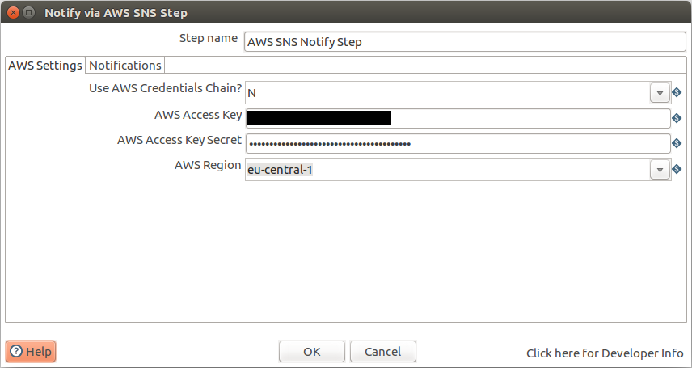
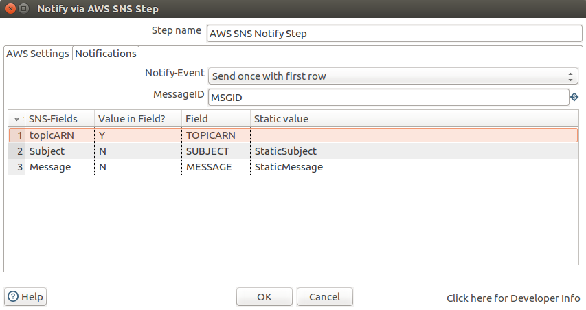

# Usage

## Preconditions

Before the first execution you need to create an IAM-Role (e.g. for usage on EC2/ECS) or an IAM-User with an AWS Key and Secret and attach the required policies for pushing notifications via SNS.  
You also need to create one ore more subscription topics you want to push the messages to.

## Settings

On the Settings Tab you need to define your AWS Credentials. You can choose either to have the plugin search these credentials via the [AWS Credentials Chain][aws-chain] or provide the following:

- your AWS Access Key,
- the Secret for your AWS Access Key and
- the AWS-Region the service is running in.

## Notifications

On the Notifications Tab you can define the behaviour when notifications will be send, the topicARN, the content and a Field for the MessageID.

### Event-Type

Please choose wether a notifications should be send with

- the first row (recommended)
- or for each row (be carefully not to spam your users!).

### Message-ID

For each notification a Message-ID is retrieved from SNS. This can be written to an output field defined here.

### Table

**In the table only three rows are valid** (all others will be ignored an refused on save/load of transformation):

- topicARN
- Subject
- Message

The topicARN, subject and message can each either be read from the row or defined as a static value.

[aws-chain]: https://docs.aws.amazon.com/sdk-for-java/v1/developer-guide/credentials.html